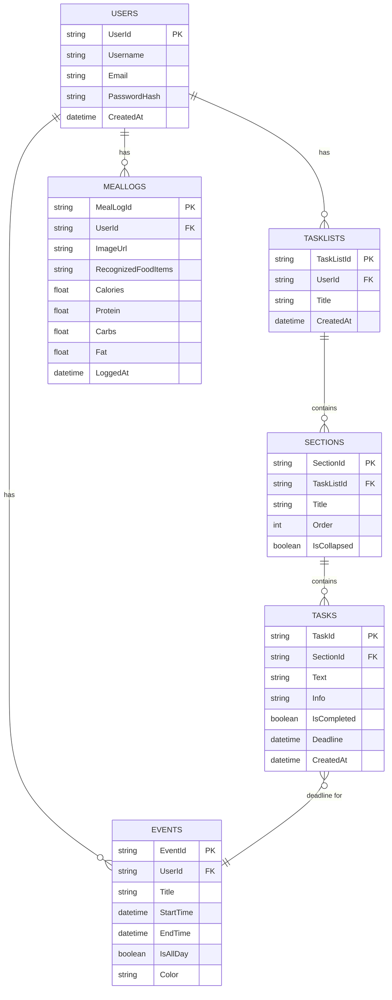

# MotiAI Backend Design

This document outlines the database schema and RESTful API design for the MotiAI application.

## 1. Database Schema

We will use a relational database model. The primary entities are `Users`, `TaskLists`, `Sections`, `Tasks`, `Events`, and `MealLogs`.

## 2. RESTful API Endpoints

The API will be organized by resource.

### Authentication

- `POST /api/auth/register`: Register a new user.
- `POST /api/auth/login`: Log in a user and return a JWT.
- `GET /api/auth/me`: Get the current user's profile.

### Task Lists

- `GET /api/tasklists`: Get all task lists for the authenticated user.
- `POST /api/tasklists`: Create a new task list.
- `GET /api/tasklists/{listId}`: Get a single task list with its sections and tasks.
- `PUT /api/tasklists/{listId}`: Update a task list's properties (e.g., title).
- `DELETE /api/tasklists/{listId}`: Delete a task list.

### Sections

- `POST /api/tasklists/{listId}/sections`: Create a new section in a task list.
- `PUT /api/sections/{sectionId}`: Update a section's properties.
- `DELETE /api/sections/{sectionId}`: Delete a section.

### Tasks

- `POST /api/sections/{sectionId}/tasks`: Create a new task in a section.
- `PUT /api/tasks/{taskId}`: Update a task's properties (e.g., text, completed status).
- `DELETE /api/tasks/{taskId}`: Delete a task.

### Events

- `GET /api/events?start={startDate}&end={endDate}`: Get all events for the user within a date range.
- `POST /api/events`: Create a new event.
- `PUT /api/events/{eventId}`: Update an event.
- `DELETE /api/events/{eventId}`: Delete an event.

### Meal Logging (Phase 3)

- `POST /api/meals/log`: Upload a meal photo for analysis.
- `GET /api/meals`: Get a history of the user's logged meals.
